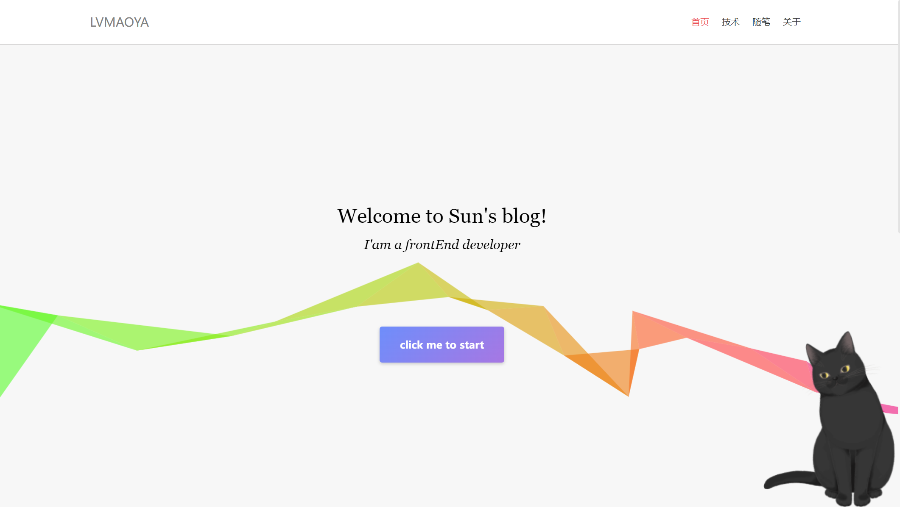
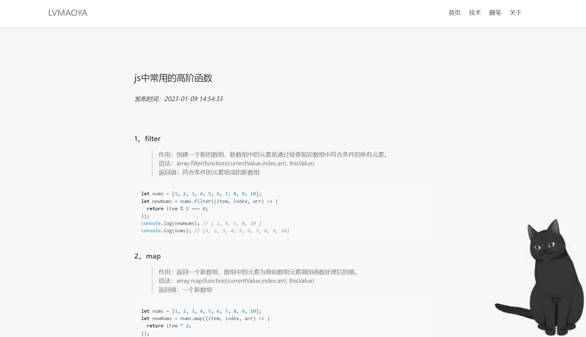
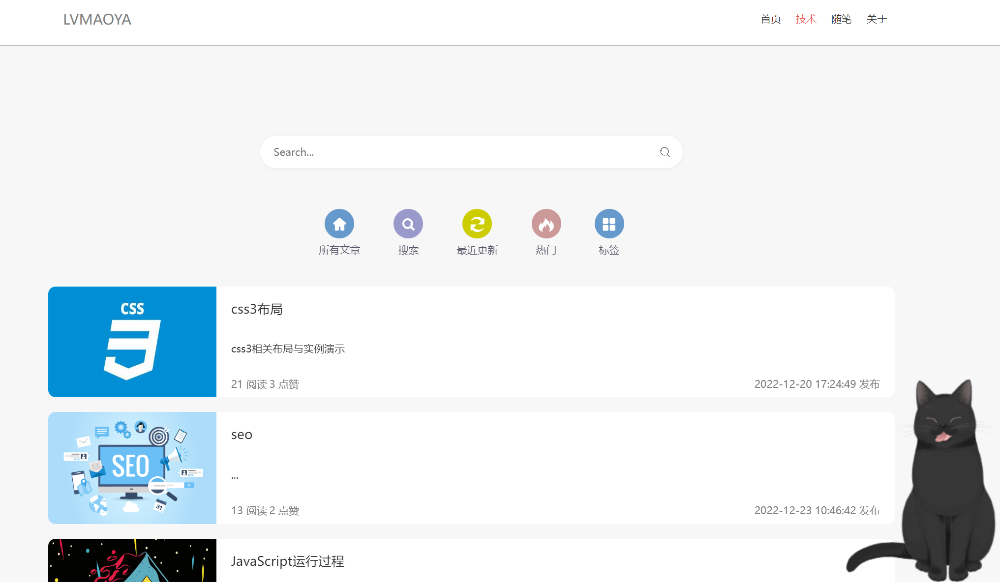
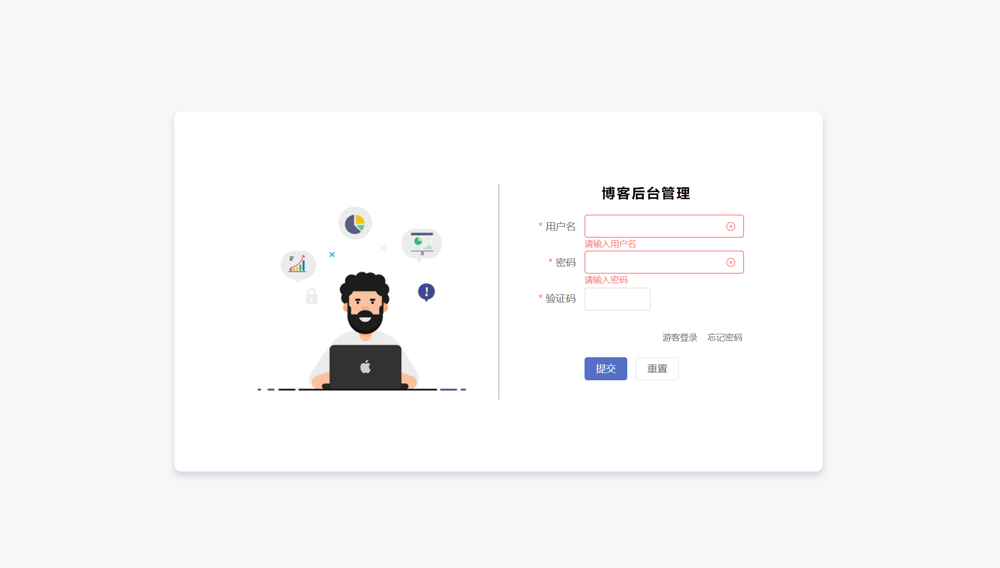
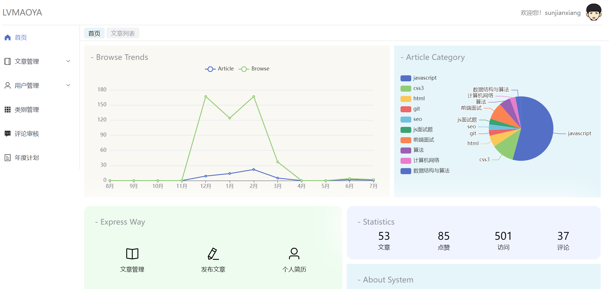

## 关于这个项目
### 1.个人博客系统
#### 1.1相关页面
 
 
 
 
 

#### 1.2技术栈
  前端：nuxt3、vue3、typescript、echarts
  后端：node、express
  数据库：mysql
    
#### 1.3项目启动
   建表：sql在目录里
   进入到相关文件夹，安装相关依赖：npm install
   serve端执行命令：node app.js 或者 nodemon app.js 
   前端：npm run dev
   notice：node服务端支持https,如果需要发布https则需要在https文件夹中补充相应文件,并修改app.js中相关https配置
